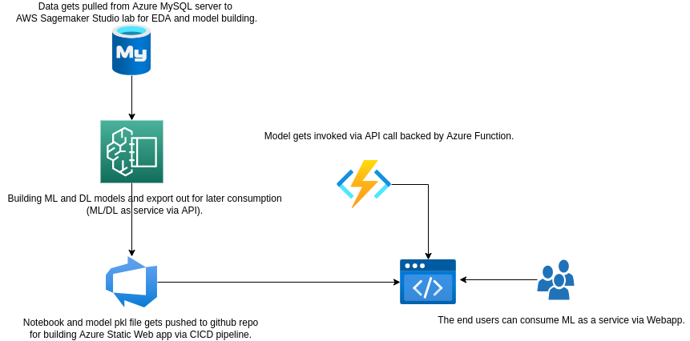
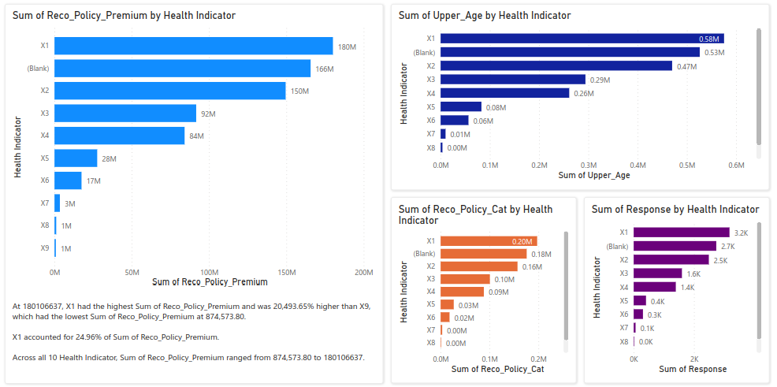

# EDA for Zomato Dataset
## 1. Introduction
### 1.1	Overview

This is EDA covering Zomato Dataset to be used as a reference for other developers. The workflow is based on the following:
- Notebooks: A set of notebooks for Deep Learning model prediction
- Github Codespace (devcontainer & Dockerfile)

## 2 Logical Architecture
### 2.1	Logical System Component Overview

- Data gets pulled from Azure MySQL server to AWS Sagemaker Studio lab for EDA and model building.
- [DL Notebooks](https://github.com/lyoh001/EDAZomato/blob/main/notebook/notebook.ipynb) 

## 3 Power BI Dashboard for Visualization

